# HTML/CSS & JavaScript 演習問題

本演習問題用のフォルダ（以下、演習フォルダ）を作成して各演習を進めてください。

<br>

## 1 HTML/CSS

演習を進めながら書籍情報ページを作成していく。最終的なページの構成は以下のようになる。

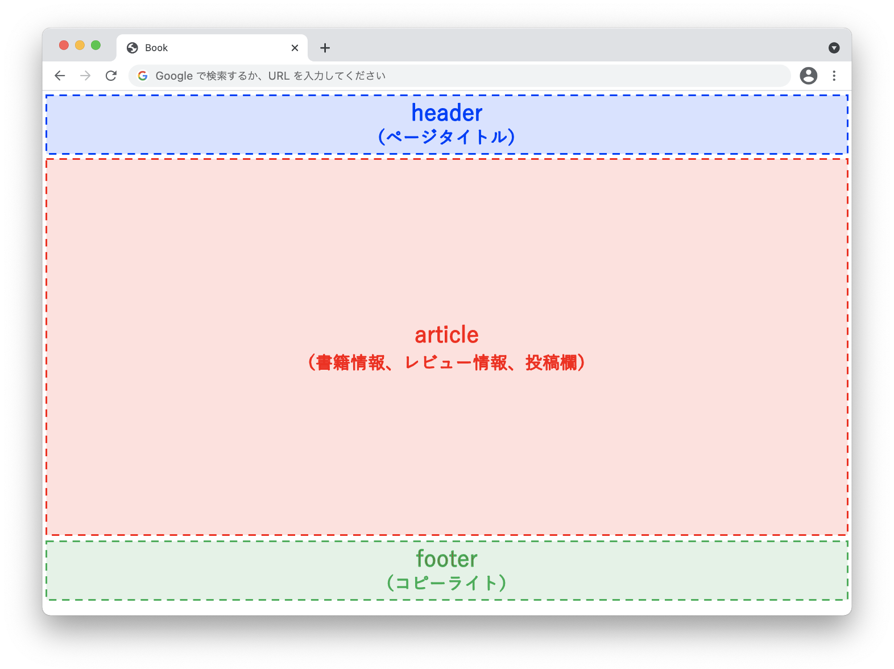

<br><br>

### 演習1.1（画像の表示）

演習フォルダにimgフォルダを作成し、以下の画像をbook.pngというファイル名で保存する。<br>演習フォルダ直下にbook-info.htmlを作成し、保存した画像をarticle部に表示する。画像は相対パスで指定する。

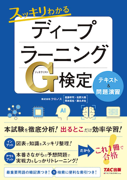

<br><br>

[解答例](ans/01-01.md)


<br><br>

### 演習1.2（リンクの追加）

画像をクリックすると以下のサイトに別タブで遷移するようにする。

URL: https://www.amazon.co.jp/dp/4300101019/

<br>

[解答例](ans/01-02.md)

<br><br>

### 演習1.3（書籍名の追加）

画像の上部にh1タグで書籍名を表示する。

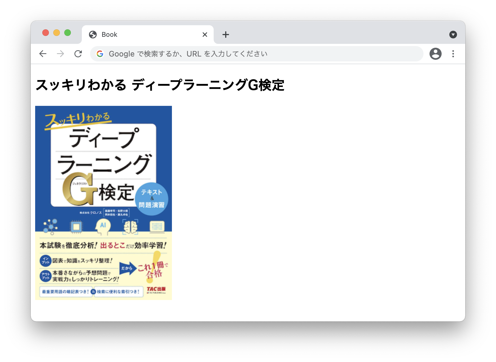

<br><br>

[解答例](ans/01-03.md)

<br><br>

### 演習1.4（ヘッダーの追加）

header部にタイトルを追加する。

```html
<body>
    <header>
        <span>書籍情報</span>
    </header>
    <article>
        <!-- 中略 -->
    </article>
</body>
```

<br>

header内のspanタグに適切なクラス名を指定し、外部スタイルシートを適用してフォントサイズを大きくする。フォントサイズは `x-large` とする。<br>演習フォルダにstaticフォルダを作成し、staticフォルダ内にstyle.cssファイルを作成しなさい。

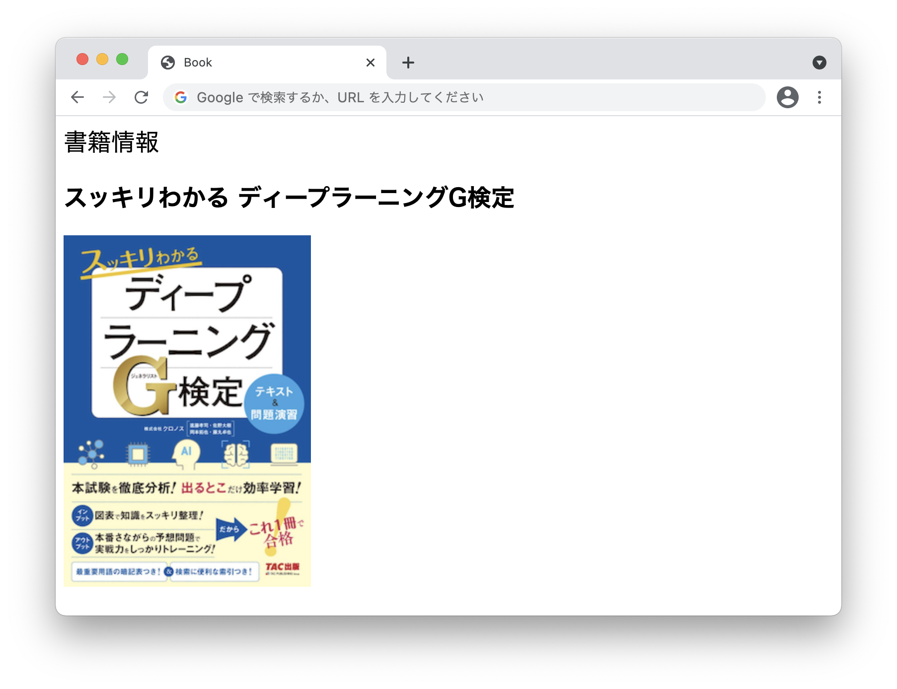

<br><br>

[解答例](ans/01-04.md)

<br><br>

### 演習1.5（背景色の追加）

headerに背景色を適用する。色は自由に決めてOK。

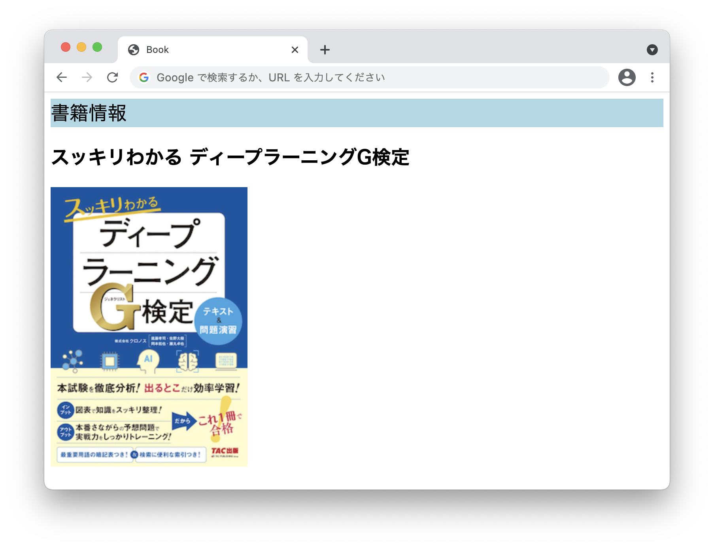

<br><br>

[解答例](ans/01-05.md)

<br><br>

### 演習1.6（内部余白の設定）

headerに内部余白を設定する。余白のサイズは自由に決めてOK。

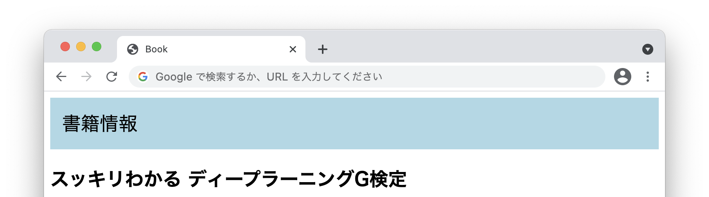

<br><br>

[解答例](ans/01-06.md)

<br><br>

### 演習1.7（余白の除去）

以下のようにページ全体の周りにある余白を消去する。

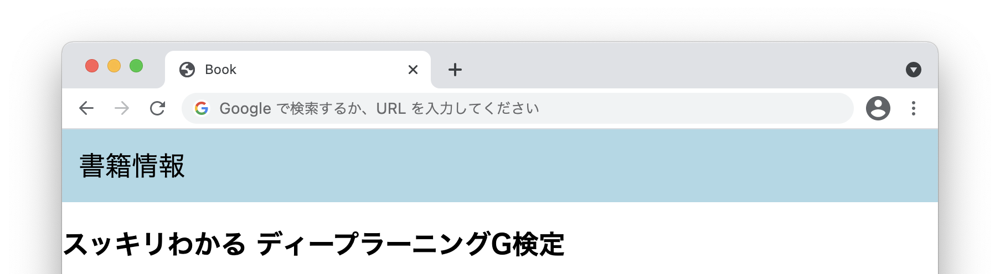

<br>

> ヒント：Chromeの開発者ツールを使って、どこに余白ができているのか確認してみてください。

<br><br>

[解答例](ans/01-07.md)

<br><br>

### 演習1.8（外部余白の設定）

articleの両端に5%ずつ余白をつける。

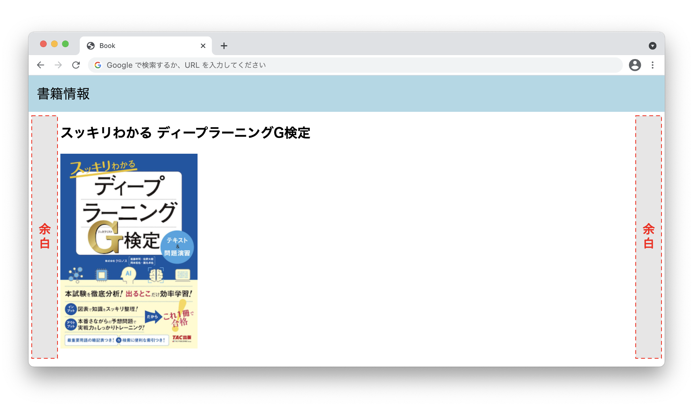

<br><br>

[解答例](ans/01-08.md)

<br><br>

### 演習1.9（グリッドレイアウトの適用）

CSSのグリッドレイアウトを使用して以下のように領域を分割し、それぞれ背景色を適用する。

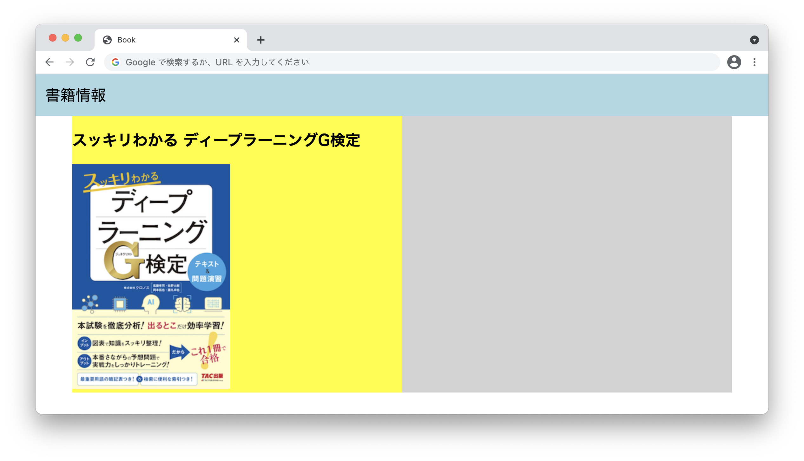

> 参考：<a href="https://qiita.com/kura07/items/e633b35e33e43240d363" target="_blank">https://qiita.com/kura07/items/e633b35e33e43240d363</a><br>※別タブで開くために、Ctrlキー（またはCommandキー）を押しながらリンクをクリックしてください。

<br>

[解答例](ans/01-09.md)

<br><br>

### 演習1.10（中央寄せ）

グリッドの左側（書籍情報）を中央寄せにする。

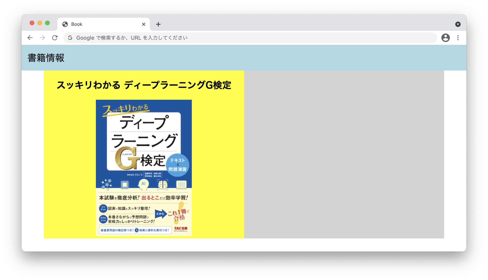

<br><br>

[解答例](ans/01-10.md)

<br><br>

### 演習1.11（レビュー情報の追加）

グリッドの右側にレビュー情報（星、コメント、水平線）を表示する。<br>星はオレンジ色で表示する。

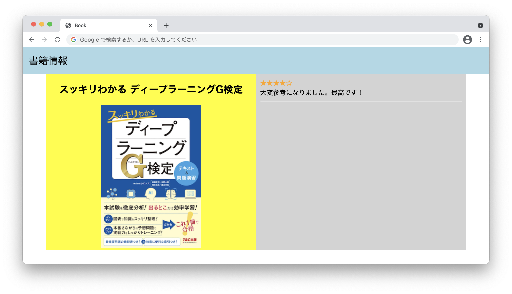

<br><br>

[解答例](ans/01-11.md)

<br><br>

### 演習1.12（投稿欄の追加）

article内の下部に投稿欄（総合評価、コメント欄、投稿ボタン）を追加し、背景色をつける。<br>総合評価は1〜5を選択可能とする。コメント欄は最大50文字とし、入力のヒント（補助文）を表示する。

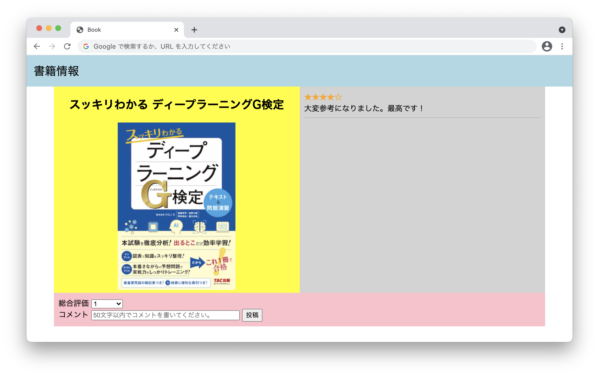

<br><br>

[解答例](ans/01-12.md)

<br><br>

### 演習1.13（フッターの追加）

ページの下部にfooterを追加し、中央寄せでコピーライト（"© 2002 Kelonos Co, Ltd"）を表示する。<br>articleのグリッドに設定していた背景色を消す。

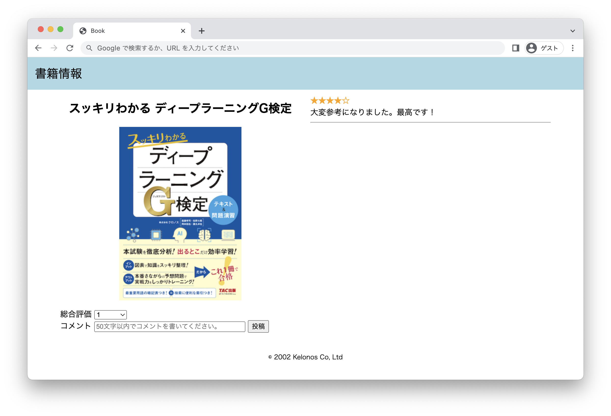

<br><br>

[解答例](ans/01-13.md)

<br><br>

ここまで作成した書籍情報ページは、次のJavaScriptの章で引き続き利用します。

<br><br><br>
<hr>

## 2 JavaScript

演習フォルダ内に各JSファイルを作成して演習を進める。最後に、JavaScriptで書籍情報ページにレビュー投稿機能を追加する。

<br>

### 演習2.1（変数の入れ替え）

**js-exercise1.html**<br>変数xに10を、変数yに20を、変数zに30を代入する。変数の内容を入れ替え、変数xの内容は変数yに、変数yの内容は変数zに、変数zの内容は変数xになるようにする。入れ替え後の結果をブラウザのコンソールに表示する。

> ブラウザの開発者ツールを開き、コンソールで実行結果を確認してください。

<br>

**期待結果**

```
x = 30
y = 10
z = 20
```

<br>

**サンプルプログラム**

```html
<!DOCTYPE html>
<html>
<head>
    <meta charset="UTF-8">
    <title>Exercise</title>
</head>
<body>
    <script type="text/javascript">
    // 処理
    </script>
</body>
</html>
```

<br>

[解答例](ans/02-01.md)

<br><br>

### 演習2.2（判定処理）

**js-exercise2.html**<br>整数を代入する変数ageと論理値(true,false)を代入する変数licenseを用意し、以下のそれぞれの結果をブラウザのコンソールに表示する。

|  | 変数licenseがtrueの場合 | 変数licenseがfalseの場合 |
|--|:-:|:-:|
| ageが20以上の場合 | "OK"を表示 | "OK"を表示 |
| ageが20未満の場合 | "OK"を表示 | "NG"を表示 |

<br>

[解答例](ans/02-02.md)

<br><br>

### 演習2.3（合計値の算出）

**js-exercise3.html**<br>反復構造と分岐構造を使って、1～10の中の奇数値の合計を計算し、結果をブラウザのコンソールに表示する。

<br>

**期待結果**

```
合計 = 25
```

<br>

[解答例](ans/02-03.md)

<br><br>

### 演習2.4（最大値の算出）

**js-exercise4.html**<br>配列numbersに [32, 45, 11, 24, 63] の複数の値を代入する。反復構造と分岐構造を使って、配列の中から最大値をブラウザのコンソールに表示する。ただし、JavaScript標準の関数などは使用不可とする。

<br>

**期待結果**

```
最大値 = 63
```

<br>

[解答例](ans/02-04.md)

<br><br>

### 演習2.5（絶対値の加算）

**js-exercise5.html**<br>配列numbersに [10, -5, 8, -10, -3, 7, 12, -15] の複数の値を代入する。反復構造と分岐構造を使って、配列の中の合計値を算出する。負の値の場合は絶対値にして加算する。計算結果をブラウザのコンソールに表示する。ただし、JavaScript標準の関数などは使用不可とする。

<br>

**期待結果**

```
合計 = 70
```

<br>

[解答例](ans/02-05.md)

<br><br>

### 演習2.6（配列の比較）

**js-exercise6.html**<br>配列numbers1とnumbers2のそれぞれに以下の複数の整数が入っている。不一致な値の個数を求め、ブラウザのコンソールに表示する。ただし、JavaScript標準の関数などは使用不可とする。

```
配列numbers1：[3, 1, 4, 1, 5, 9, 2, 6, 5, 3]
配列numbers2：[3, 2, 4, 1, 5, 8, 2, 6, 5, 1]
```

<br>

**期待結果**

```
不一致数 = 3
```

<br>

[解答例](ans/02-06.md)

<br><br>

### 演習2.7（★の表示）

**js-exercise7.html**<br>ブラウザのコンソールに以下のように★を表示する。ただし、コンソールへの出力処理は1ヶ所のみとする。

<br>

**期待結果**

```
★
★★
★★★
★★★★
★★★★★
```

<br>

[解答例](ans/02-07.md)

<br><br>

### 演習2.8（数字の表示）

**js-exercise8.html**<br>ブラウザのコンソールに以下のように数字を表示する。ただし、コンソールへの出力処理は1ヶ所のみとする。

<br>

**期待結果**

```
111111111
22222222
3333333
444444
55555
6666
777
88
9
```

<br>

[解答例](ans/02-08.md)

<br><br>

### 演習2.9（九九表の表示）

**js-exercise9.html**<br>ブラウザのコンソールに以下のような九九表を表示する。ただし、コンソールへの出力処理は1ヶ所のみとする。

<br>

**期待結果**

```
1   2   3   4   5   6   7   8   9
2   4   6   8   10  12  14  16  18
3   6   9   12  15  18  21  24  27
4   8   12  16  20  24  28  32  36
5   10  15  20  25  30  35  40  45
6   12  18  24  30  36  42  48  54
7   14  21  28  35  42  49  56  63
8   16  24  32  40  48  56  64  72
9   18  27  36  45  54  63  72  81
```

<br>

[解答例](ans/02-09.md)

<br><br>

### 演習2.10（合計金額の算出）

**js-exercise10.html**<br>単価と数量を保持する二次元配列がある。それぞれの単価と数量から小計を求め、各小計を合算して合計を求めて表示する。小計の算出は関数を用い、引数の単価と数量で算出した小計を返すようにする。ただし、引数の数量が0未満の場合は0を返すこととする。

```
配列items：[[100, 50], [200, 20], [300, 30], [400, -1]]
```

<br>

**期待結果**

```
合計金額 = 18000円
```

<br>

[解答例](ans/02-10.md)

<br><br>

### 演習2.11（★の動的な表示）

**js-exercise11.html**<br>テキストボックスとボタンを用意する。ボタンクリックで、テキストボックスに指定した数値の数分、★の階段をコンソールに表示する。

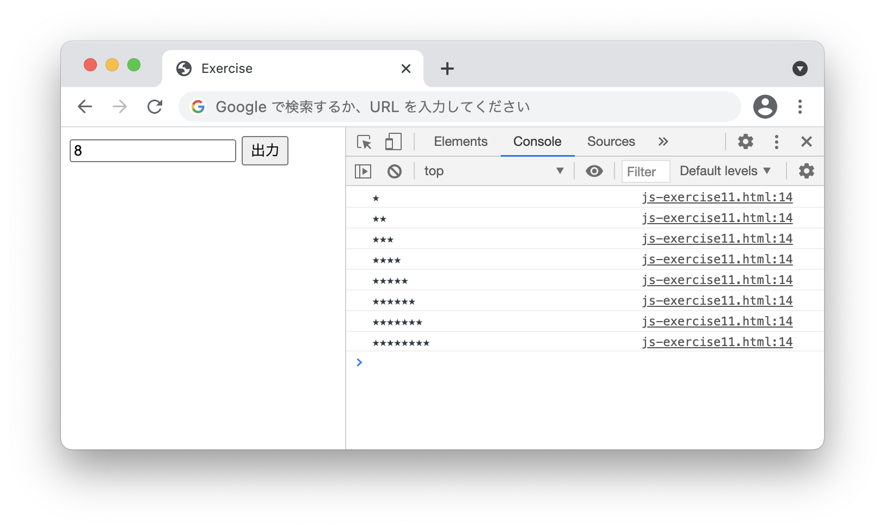

```html
<!DOCTYPE html>
<html>
<head>
    <meta charset="UTF-8">
    <title>Exercise</title>
    <script type="text/javascript">
    // 処理
    </script>
</head>
<body>
    <div>
        <label for="count"></label>
        <input type="number" id="count" value="0">
        <button type="button">出力</button>
    </div>
</body>
</html>
```

<br>

[解答例](ans/02-11.md)

<br><br>

### 演習2.12（四則演算プログラム）

**js-exercise12.html**<br>テキストボックス2つとボタンを用意する。ボタンクリックで、テキストボックスに指定した2つの値の加算結果を画面に表示する。加算結果の表示は、`id="result"` を持つdiv要素（以下、結果div要素）の中にテキストノードを追加することで実現すること。

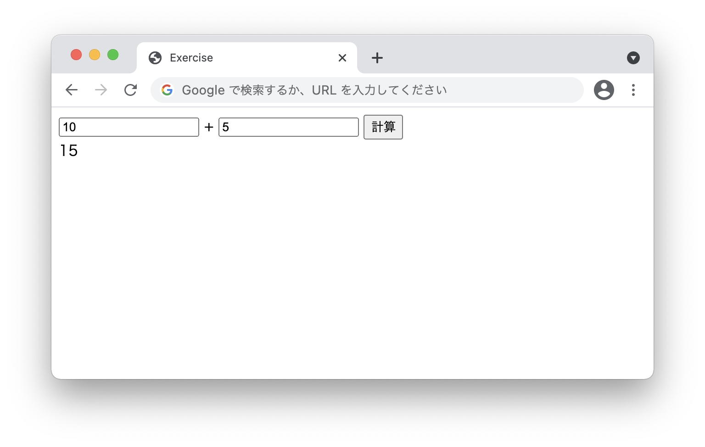

```html
<!DOCTYPE html>
<html>
<head>
    <meta charset="UTF-8">
    <title>Exercise</title>
    <script type="text/javascript">
    // 処理
    </script>
</head>
<body>
    <div>
        <input type="number" id="num1" value="0">
        <span>+</span>
        <input type="number" id="num2" value="0">
        <button type="button" onclick="calc()">計算</button>
    </div>
    <div id="result">
    </div>
</body>
</html>
```

<br>

> ヒント：四則演算をするため、parseInt関数でテキストボックスの入力値を数値に変換する必要があります。

<br>

[解答例](ans/02-12.md)

<br><br>

### 演習2.13（四則演算プログラムの続き）

**js-exercise12.html**<br>加算結果の表示を以下のように修正する。

1. h1の要素ノードを作成する。
2. h1の要素ノードに加算結果を持つテキストノードを追加する。
3. 結果div要素にh1の要素ノードを追加する。

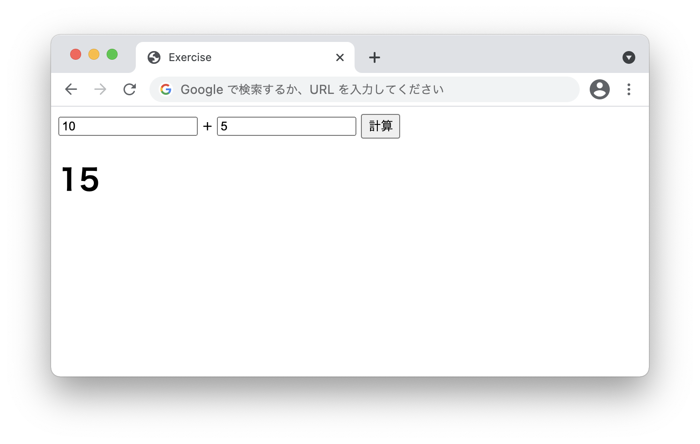

<br><br>

[解答例](ans/02-13.md)

<br><br>

### 演習2.14（四則演算プログラムの続き）

**js-exercise12.html**<br>現時点で計算ボタンをクリックする度に加算結果が次々に追加表示される。この問題を解消するために結果div要素内の最初の子要素と加算結果を持つ要素（h1要素）を置換する処理に変更する。<br>※修正後に加算結果が追加表示されないことを確認すること。

> h1要素を追加する前に結果div要素内の最初の子要素を削除する方法でも同様の処置ができることを確認してみましょう。

<br>

[解答例](ans/02-14.md)

<br><br>

### 演習2.15（四則演算プログラムの続き）

**js-exercise12.html**<br>作成したh1の要素ノードにフォント色を赤にするstyle属性を追加する。加算結果が赤色で表示されること。

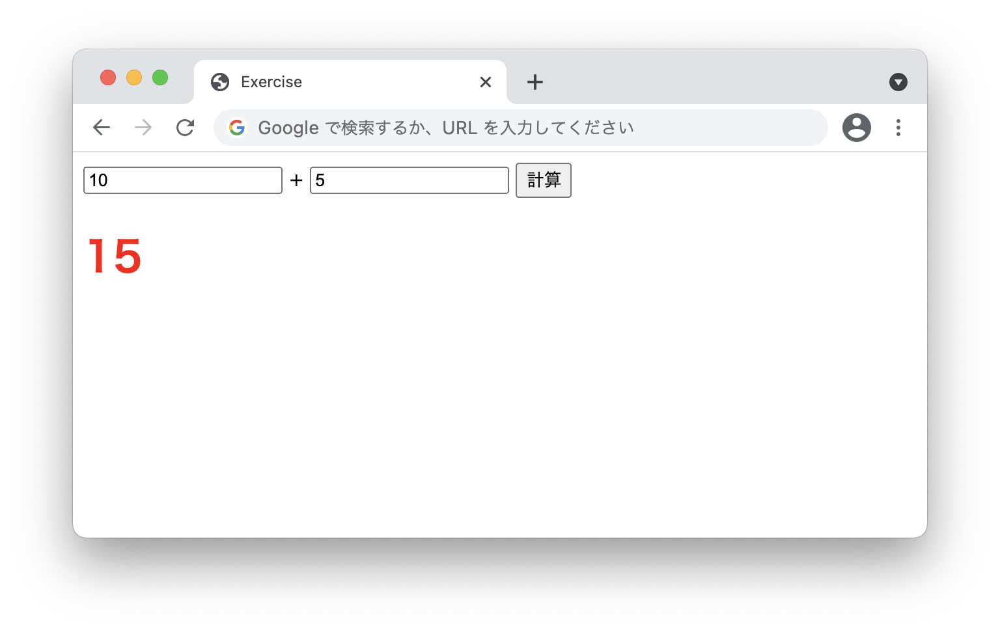

<br><br>

[解答例](ans/02-15.md)

<br><br>

### 演習2.16（四則演算プログラムの続き）

**js-exercise12.html**<br>いずれか、または両方のテキストボックスの値が未入力の場合、「数値の入力が不正です。」のアラートを表示し、処理を終了する。

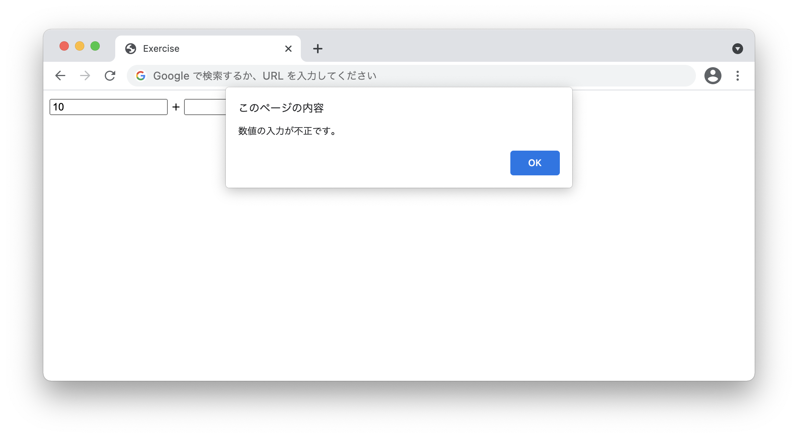

<br><br>

[解答例](ans/02-16.md)

<br><br>

### 演習2.17（書籍情報ページ作成の続き）

HTML/CSSの演習問題で作成した書籍情報ページにJavaScriptを使って投稿機能を追加する。<br>コメント欄を入力し、投稿ボタンをクリックすることでコメント内容が画面に追加表示されるようにする（※総合評価の追加は次演習で行う）。<br>staticフォルダ内にscript.jsファイルを作成し、HTMLファイル（book-info.html）から参照しなさい。

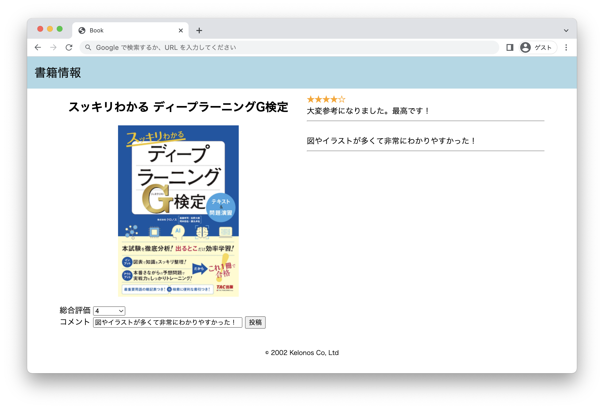

<br><br>

[解答例](ans/02-17.md)

<br><br>

### 演習2.18（書籍情報ページ作成の続き）

総合評価を選択し、投稿ボタンをクリックすることで、選択した数分の★と残余の☆が画面に追加表示されるようにする。

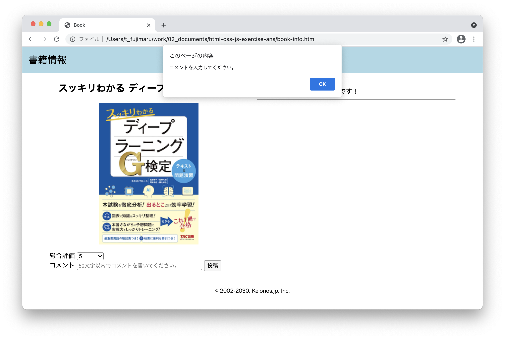

<br><br>

[解答例](ans/02-18.md)

<br><br>

### 演習2.19（書籍情報ページ作成の続き）

レビュー投稿後に総合評価を1に、コメント欄を空に初期化する。

<br><br>

[解答例](ans/02-19.md)

<br><br>

### 演習2.20（書籍情報ページ作成の続き）

投稿時にコメント欄が未入力の場合、「コメントを入力してください。」のエラーメッセージを表示し、処理を終了する。

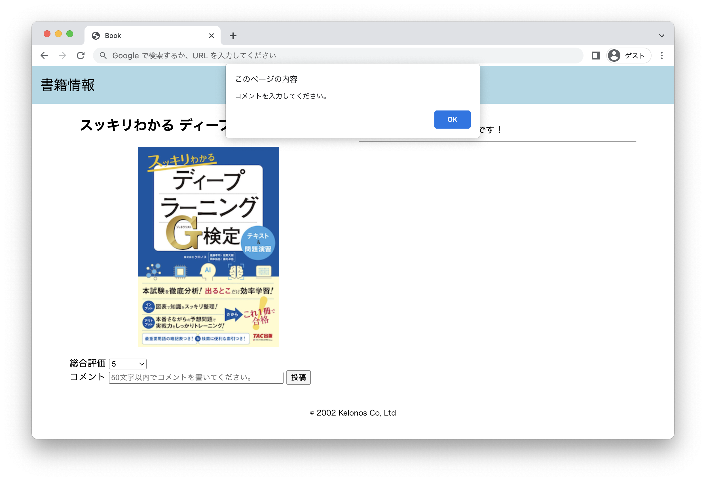

<br><br>

[解答例](ans/02-20.md)
